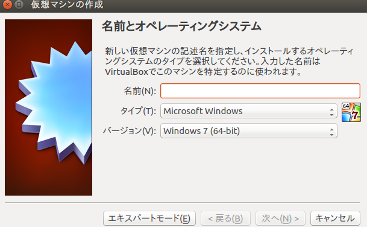
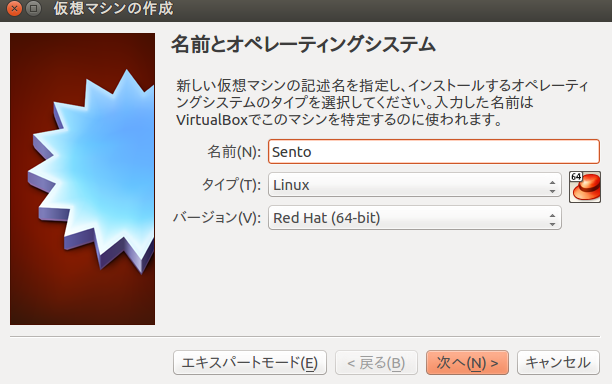
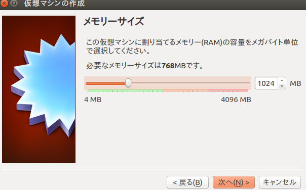
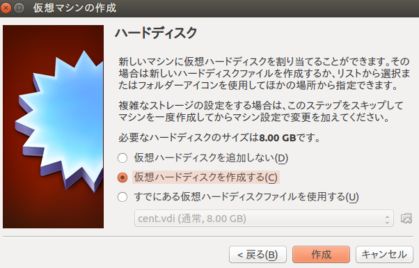
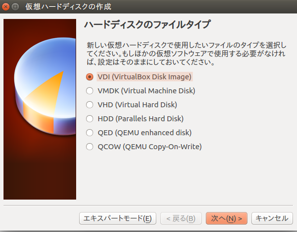
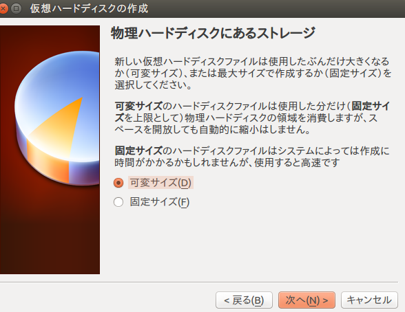
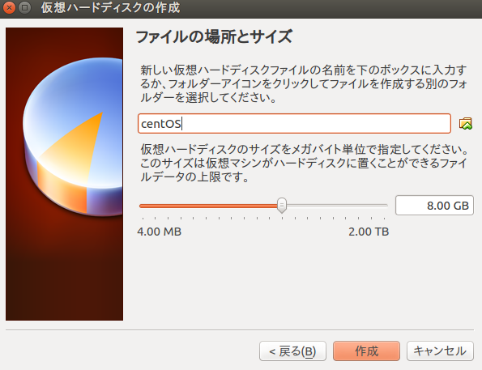

#Section1 基本のサーバー構築

##Section1-1 CentOS 7のインストール

CentOSの公式サイトよりCentOS 7 Minimal ISO(x86_64)のISOファイルをダウンロードし、 VirtualBox上にインストールしてください。

先生からUSBを借りCentOS-7-x86_64-Minimal-1511.isoを自分のパソコンにコピーします。(コピー先は自分が把握できる場所に)

[Section0-1](https://github.com/n15011/wordpress/blob/master/Section0.md)でやったように

    $ virtualboxi

を起動します。

起動したら**新規**をクリック、その次にエキスパートモードをクリックします。すると下の画面と同じものが表示されるはずです。

次に仮想マシンの名前を**Centos**にするとタイプとバージョン自動で切り替わってくれます。

名前を入力後タイプが**Linux**バージョンが**Red Hat(64-bit)**に切り替わってることを確認して次の画面へ。

メモリサイズを**1G(1024MB)**にします。

次へ

仮想ハードディスクの作成。

次へ

ハードディスクのファイルタイプ

VDI(VirtualBox Disk Image)を選択

次へ

物理ハードディスクにあるストレージ

可変サイズを選択

次へ

ファイルの場所とサイズ 

ここで仮想ハードディスクのサイズを**8G**に設定します

次へ

すると最初の初期画面に戻るはずです。ここからすぐ仮想マシンの電源はつけずに**設定**を選択します

