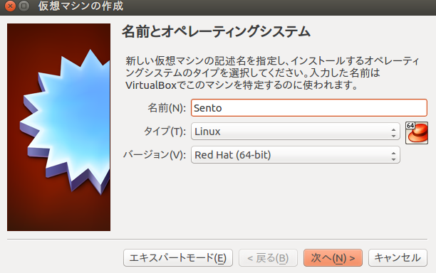

#Section1 基本のサーバー構築

##Section1-1 CentOS 7のインストール

CentOSの公式サイトよりCentOS 7 Minimal ISO(x86_64)のISOファイルをダウンロードし、 VirtualBox上にインストールしてください。

先生からUSBを借りCentOS-7-x86_64-Minimal-1511.isoを自分のパソコンにコピーします。(コピー先は自分が把握できる場所に)

[Section0-1](https://github.com/n15011/wordpress/blob/master/Section0.md)でやったように

    $virtualboxi

を起動します。

起動したら"新規"をクリック、その次にエキスパートモードをクリックします。

仮想マシンの名前を"Centos"にするとタイプとバージョン自動で切り替わってくれます。

